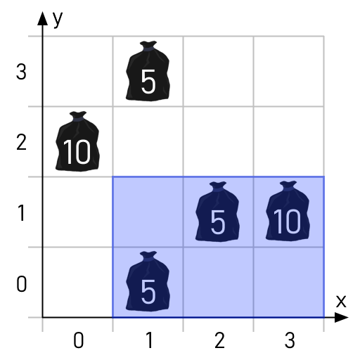

# Garbage Collection
The north sea is littered with $N$ pieces of garbage, numbered $1 \dots N$. The $i$'th piece is at position $(x_i, y_i)$ and has a weight of $w_i$. As part of a cleanup effort, all garbage within a rectangular area will be collected. This area has a width of $W$ and a height of $H$, but its location has not yet been decided.

Determine the maximum total weight of garbage that will be collected if the cleanup area is positioned optimally.

## Input
The first line contains the integers $N$, $W$ and $H$.

The $i$'th of the next $N$ lines contains the integers $x_i$, $y_i$ and $w_i$.

## Output
Your program should output a single integer: The maximum total weight of garbage that can be collected.

## Constraints
- $1 \le N \le 10^5$.
- $1 \le W,H \le 10^9$.
- $0 \le x_i,y_i < 10^9$ for all $i : 1 \le i \le N$.
- $1 \le w_i \le 10^9$ for all $i : 1 \le i \le N$.

## Subtasks
1. (10 points) $N \le 400$.
2. (12 points) $W,H,x_i,y_i < 2000$ for all $i : 1 \le i \le N$.
3. (15 points) $N \le 2000$.
4. (22 points) $H = 10^9$.
5. (23 points) $W,H,x_i,y_i < 10^5$ for all $i : 1 \le i \le N$.
6. (18 points) *No additional constraints.*

## Example
### Input
```
5 3 2
3 1 10
2 1 5
1 0 5
0 2 10
1 3 5
```

### Output
```
20
```

### Explanation
The optimal area is the one covering the garbage at $(3,1)$, $(2,1)$ and $(1,0)$ with a total weight of $10+5+5=20$.

