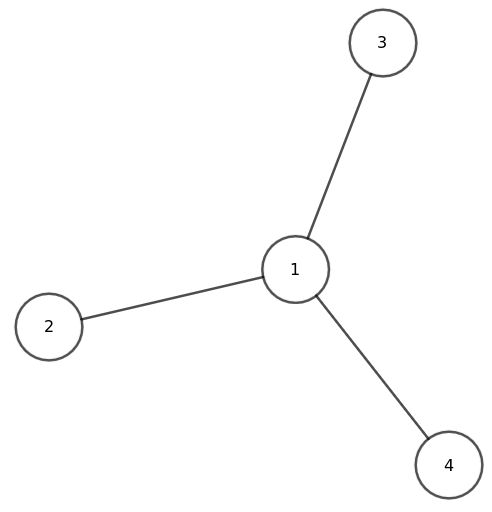
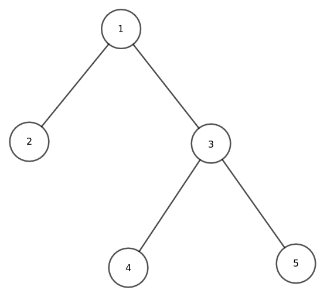

# Xoracle

Long ago, in the heart of the Xordic countries, there was a brave soldier named Ronni.
Ronni was known for their courage and sharp mind, often solving puzzles that baffled even the wisest sages.
One day, Ronni was summoned to the ancient forest where a mystical tree stood.
This tree was no ordinary tree -- it was entirely invisible, with its nodes and branches hidden from mortal eyes.
On each node of the tree sits an ancient spirit, and the degree of each node held the key to understanding the tree's structure.

The kingdom's oracle, known as the **Xoracle**, was a powerful entity that could only answer one type of query:

"Tell me the bitwise XOR of the degrees of node A and node B."

Armed with this cryptic knowledge, Ronni had to deduce the degree of all $N$ nodes in the tree in order to conquer the ancient spirits,
and to reveal the tree's secrets.
However, the Xoracle would only answer up to $Q$ queries before sealing its wisdom forever.

Ronni's task is to determine the degrees of all nodes in the invisible tree using the Xoracle's responses.
The tree, with $N$ nodes and $N-1$ edges, is connected, meaning there is a path between any pair of nodes.
The degree of a node is the number of edges connected to it.
By strategically choosing pairs of nodes and interpreting the bitwise XOR of their degrees,
Ronni aimed to reconstruct the degrees of all nodes in the tree.

## Interaction

Your program should start by reading a single line with two space seperated integers $N$ and $Q$,
the number of nodes in the tree, and the maximum number of queries you are allowed to ask the Xoracle.
The nodes of the tree are numbered from $1$ up to $N$.

Afterwards, your program can make up to $Q$ queries.
To ask a query, your program should output a line of the form `"? i j"` (excluding quotation marks) where $1 \leq i, j \leq N$.
The judge will then respond by writing a number sinlge number, $x$, on a line, where $x = \text{deg}(i) \oplus \text{deg}(j)$.
Here $\text{deg}(x)$ is the degree of the node $x$, and $\oplus$ is defined as the bitwise XOR.

The bitwise XOR product of two integers $a$ and $b$ is calculated by looking at the binary representations of $a$ and $b$.
The $i$'th bit of the product is $1$, if and only if either the $i$'th bit of $a$ or $b$ is $1$, but not both.
It is available as an operator in both C++ and Python as `^`.

After your queries, your program must output the degrees of all nodes.
This is done by outputting on a new line `"!"` (without quotation marks) followed by a space and $N$ space seperated integers, the degrees of all $N$ nodes in any order.
This is not counted towards the number of queries your program is allowed to make.

To recieve an answer for a query, and to submit the degrees at the end, your program should flush the ouput.
This can be done in one of the following ways:

* C++: `std::cout << std::endl;`
* Python: `print("", flush=True)`

## Constraints

- $2 \leq N \leq 10^5$.

## Subtasks

1. (8 points) The maximum degree of any nodes is 3. There exists at least 1 node of each degree 1, 2, and 3. $N \leq 1000$, $Q = N - 1$.
2. (5 points) The maximum degree of any nodes is 4. At least 3 of the possible 4 degrees appear in the tree. $N \leq 1000$, $Q = N - 1$.
3. (9 points) $Q = N^2$, $N \leq 300$.
4. (11 points) $Q = 35000$, $N \leq 1000$.
5. (24 points) $Q = N - 1$, $N \leq 1000$.
6. (43 points) $Q = N - 1$.

## Examples

### Example 1

Observe the tree shown in Figure 1.



Consider the following interaction, where `>` denotes the judge and `<` the contestant solution.

```
> 4 3
< ? 2 4
> 0
< ? 4 1
> 2
< ? 3 3
> 0
< ! 1 3 1 1
```

- First the numbers N and Q are given.

- Then a query for node 2 and 4 is made, giving the result 0.

- Then a query for node 4 and 1 is made, giving the result 2.

- Then a query for node 3 and 3 is made, giving the result 0.

- At last, the program answers that the degrees of the tree are `1, 3, 1, 1`, which is correct.

(Note that the degrees can be given in any order.)

It may or may not be possible to conclude the correct answer using the queries given in the example.

### Example 2

Observe the tree shown in Figure 2.



Consider the following interaction, where `>` denotes the judge and `<` the contestant solution.

```
> 5 4
< ? 1 2
> 3
< ? 1 3
> 1
< ? 2 3
> 2
< ? 1 4
> 3
< ! 3 1 1 1 2
```

It may or may not be possible to conclude the correct answer using the queries given in the example.
